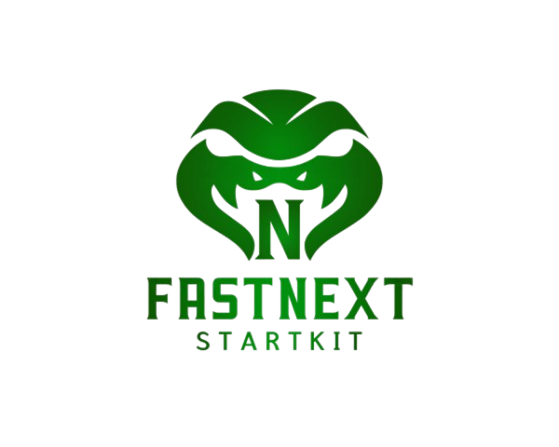

<p align="center">
  
</p>

# FASTNEXT Startkit

FASTNEXT adalah starter kit full-stack dengan backend FastAPI dan frontend Next.js App Router. Project ini sudah memakai autentikasi berbasis cookie `HttpOnly`, CSRF token untuk request perubahan data, dashboard terproteksi, halaman profil, dan halaman ubah password.

## Daftar Isi

1. [Stack](#stack)
2. [Struktur Proyek](#struktur-proyek)
3. [Setup Dengan Docker](#setup-dengan-docker)
4. [Setup Lokal Tanpa Docker](#setup-lokal-tanpa-docker)

## Stack

- Backend: FastAPI, SQLAlchemy, Alembic, Pydantic Settings
- Frontend: Next.js App Router, React, TypeScript
- Database: PostgreSQL, MySQL, atau SQLite

## Struktur Proyek

Project ini memakai struktur monorepo agar backend dan frontend tetap terpisah tetapi masih berada dalam satu repository.

```text
fastnext/
├── backend/                         # Service API utama untuk auth, user, role, dan akses database
│   ├── app/                         # Kode aplikasi backend
│   │   ├── api/                     # Lapisan HTTP API, dependency request, auth guard, dan CSRF
│   │   ├── core/                    # Konfigurasi runtime dan helper keamanan backend
│   │   ├── db/                      # Fondasi koneksi database dan SQLAlchemy
│   │   ├── models/                  # Definisi struktur tabel database
│   │   ├── repositories/            # Lapisan akses data agar query tidak tersebar
│   │   ├── schemas/                 # Kontrak request dan response API
│   │   └── services/                # Business logic aplikasi
│   └── alembic/                     # Pengelolaan migration database
├── frontend/                        # Aplikasi web Next.js
│   ├── app/                         # Definisi route dan layout halaman Next.js
│   ├── components/                  # Komponen React dengan pola atomic design
│   │   ├── atoms/                   # Elemen UI paling kecil dan reusable
│   │   ├── molecules/               # Gabungan kecil dari beberapa atom
│   │   ├── layouts/                 # Header, sidebar, breadcrumb, dan struktur layout umum
│   │   ├── organisms/               # Blok fitur besar seperti form dan konten halaman
│   │   └── templates/               # Komposisi halaman dari layout dan organism
│   ├── lib/                         # Helper frontend umum
│   ├── repositories/                # Wrapper request API
│   ├── services/                    # Service frontend yang dipakai komponen
│   ├── types/                       # Tipe TypeScript bersama
│   └── public/                      # Aset publik frontend
├── docs/                            # Aset dan dokumentasi pendukung project
├── docker-compose.yml               # Konfigurasi Compose untuk production/staging
└── README.md                        # Dokumentasi project
```

## Setup Dengan Docker

Gunakan mode ini untuk production/staging server.

### Siapkan environment

```bash
cp backend/.env.example backend/.env
cp frontend/.env.example frontend/.env
```

Sesuaikan nilai `.env` dengan environment server, terutama database, CORS, secret key auth, dan URL backend/frontend.

### Jalankan service

PostgreSQL default:

```bash
docker compose up -d --build
```

MySQL:

```bash
docker compose --profile mysql up -d --build
```

SQLite:

```bash
docker compose --profile sqlite up -d --build
```

### Migrasi database dan buat superadmin pertama

```bash
docker compose exec backend alembic upgrade head
docker compose exec backend python createsuperuser.py
```

Atau langsung dengan argumen:

```bash
docker compose exec backend python createsuperuser.py \
  --name "Superadmin" \
  --email admin@example.com \
  --password password123 \
  --no-input
```

Setelah selesai, buka frontend dan login dengan akun tersebut.

## Setup Lokal Tanpa Docker

Docker tidak diperlukan di environment lokal ini. Docker Compose hanya dipakai di production/staging.

### Backend

```bash
cd backend
cp .env.example .env
python3 -m venv .venv
source .venv/bin/activate
pip install -r requirements.txt
alembic upgrade head
python createsuperuser.py
python runserver.py
```

Atau buat superadmin langsung dengan argumen sebelum menjalankan server:

```bash
python createsuperuser.py \
  --name "Superadmin" \
  --email admin@example.com \
  --password password123 \
  --no-input
```

Jika backend perlu port eksplisit:

```bash
python runserver.py 8000
```

### Frontend

Di terminal lain:

```bash
cd frontend
cp .env.example .env
npm install
npm run dev
```

Frontend lokal berjalan di `http://localhost:3000`.

Setelah berhasil, buka `http://localhost:3000`. Jika belum login, aplikasi mengarahkan ke `/login`; setelah login berhasil, user masuk ke dashboard di `/`.
